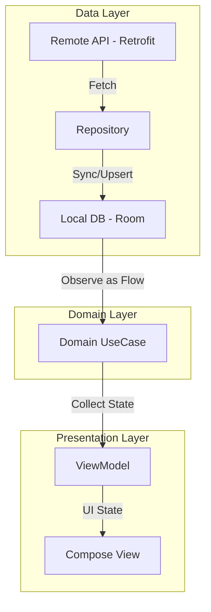

# Groww Mutual Funds Clone 🚀

A high-performance Mutual Funds tracking application built with **Clean Architecture**, **Jetpack Compose**, and **Offline-First** principles. This project is a technical demonstration of modern Android development, focusing on extreme performance, real-time data reactivity, and a premium visual experience.

---

## 🏗️ Architecture Design

The app follows a strict **Clean Architecture** pattern, ensuring separation of concerns, high testability, and a robust data synchronization strategy.

### High-Level Data Flow (Single Source of Truth)



### Layer Responsibilities:
*   **Data Layer**: Manages data orchestration between Retrofit (API) and Room (Local DB). Implements a three-layer caching strategy: Memory -> Room -> Network.
*   **Domain Layer**: Contains the core business logic (`UseCases`) and Pure Kotlin entities. It is 100% independent of the UI and Android framework.
*   **Presentation Layer**: Implements MVVM. ViewModels transform domain flows into UI states (`StateFlow`), which are rendered using Jetpack Compose.

---

## ✨ Performance Optimizations

One of the project's core objectives was to eliminate the common "lag" found in financial apps through advanced coroutine orchestration.

*   **Parallel Job Orchestration**: The `syncExploreFunds` logic uses `async/awaitAll` to fetch 5+ fund categories simultaneously without blocking the main thread.
*   **Proactive NAV Fetching**: Instead of waiting for detail screens, the app proactively fetches NAV (Net Asset Value) prices in the background for search results, ensuring the UI is populated before the user even clicks.
*   **Reactive Search**: Search results are observed directly from the Room database. This means as soon as background price updates arrive from the network, the search list updates instantly without a manual refresh.

---

## 🛠️ Tech Stack & Tooling

### Core Android
| Library | Purpose | Version |
| :--- | :--- | :--- |
| **Kotlin** | Language & Logic | `2.0.20` |
| **Jetpack Compose** | Declarative Tooling | `2024.10.00` |
| **Android Gradle Plugin** | Build System | `8.7.2` |

### Architecture & DI
*   **Hilt (`2.51.1`)**: Dependency Injection for inversion of control across all layers.
*   **Navigation Compose (`2.8.2`)**: Typed navigation with nested graph support.
*   **Hilt Navigation Compose**: Scoping ViewModels to navigation destinations.

### Data & Persistence
*   **Room (`2.6.1`)**: Local persistence for offline-first capabilities.
*   **Retrofit (`2.11.0`)**: Type-safe HTTP client for Mutual Fund APIs.
*   **OkHttp Logging Interceptor**: Monitoring network traffic during development.

### Testing Suite (The "Quality Shield")
*   **MockK (`1.13.12`)**: Powerful mocking library for standard and coroutine-based functions.
*   **Google Truth (`1.4.4`)**: Readable and fluent assertion library.
*   **Turbine (`1.1.0`)**: Streamlined testing for Kotlin `Flow` emissions.
*   **JUnit 4**: The foundational test runner.

---

## 🎨 Design & UX
*   **Dynamic Dark Mode**: A premium dark theme tailored for financial clarity (`#0D0D0D` background).
*   **Interactive Charts**: Custom-built Bézier curve charts for NAV history, featuring smooth interaction tooltips and grid systems.
*   **Micro-animations**: Leverages `AnimatedVisibility` and `Crossfade` for sleek state transitions.

---

## 🚀 Getting Started

### Prerequisites
1.  **Android Studio Koala (2024.1.1)** or newer.
2.  **JDK 17** configured in your project structure.
3.  **Kotlin 2.0+** support (K2 Compiler enabled by default).

### Installation Steps
1.  **Clone the Repository**:
    ```bash
    git clone https://github.com/poojasheoran12/Groww.git
    ```
2.  **Open in Android Studio**: Wait for the Gradle sync to finish.
3.  **Sync Data**: Upon first launch, the app will automatically trigger a parallel sync for categorized funds.
4.  **Run Tests**:
    ```bash
    ./gradlew :app:testDebugUnitTest
    ```

---

## 📂 Project Structure Detail
```text
app/src/main/java/com/example/groww/
├── data/
│   ├── local/          # Room DB, Entity & DAO definitions
│   ├── remote/         # Retrofit APIs & DTO models
│   └── repository/     # Repository implementations (The SSOT Logic)
├── domain/
│   ├── model/          # Clean Domain Entities
│   ├── repository/     # Repository Interfaces
│   └── usecase/        # Specific Business Actions
└── presentation/
    ├── explore/        # Category discovery & parallel loading
    ├── details/        # Fund details & Custom Charting
    ├── search/         # Reactive universal search
    └── watchlist/      # Portfolio management
```
